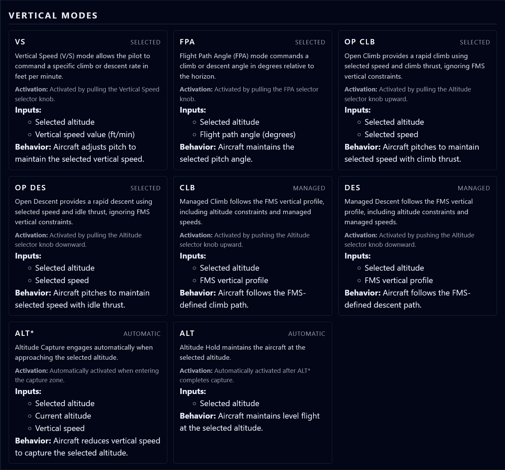
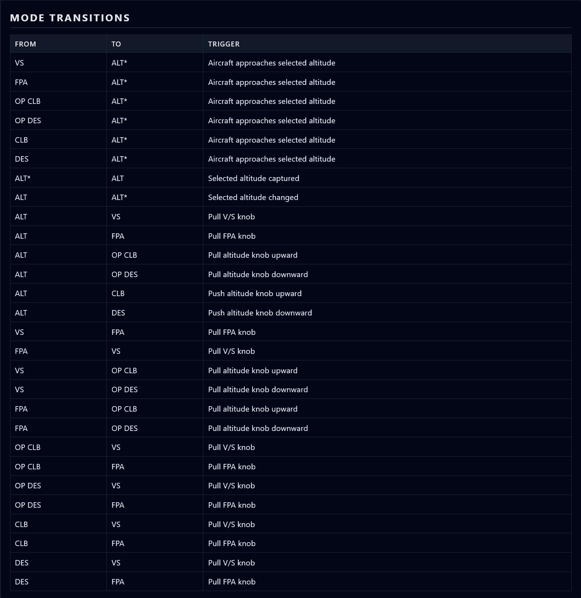

### 🔗 Live Demo  
View the rendered VMCP documentation here:  
https://mkzim13.github.io/vmcp-xml-xslt-demo/index.xml
# Vertical Mode Control Panel (VMCP) — XML/XSD/XSLT Demonstration

This project is a complete, end‑to‑end demonstration of an XML‑based data model, an XSD schema for validation, an XSLT transformation pipeline, and a CSS‑styled HTML output. It models a **Vertical Mode Control Panel (VMCP)** — a real subsystem found in modern commercial aircraft — and presents it as a polished, browser‑rendered technical documentation artifact.

The project is designed to showcase:
- Structured XML modeling
- Schema design and validation
- XSLT transformation for presentation
- CSS styling for readability and polish
- Documentation quality suitable for engineering teams

---

## ✈️ Project Overview

The VMCP controls vertical flight modes such as:
- Vertical Speed (VS)
- Flight Path Angle (FPA)
- Open Climb / Open Descent
- Managed Climb / Managed Descent
- Altitude Capture (ALT\*)
- Altitude Hold (ALT)

This project models:
- The **panel hardware** (selectors, annunciations, controls)
- The **vertical modes** (definitions, activation logic, inputs, behavior)
- The **mode transitions** (automatic and pilot‑initiated)

The XML file (`vmcp.xml`) is the authoritative source of truth.  
The XSD (`vmcp.xsd`) enforces structure and correctness.  
The XSLT (`vmcp.xsl`) transforms the XML into HTML.  
The CSS (`vmcp.css`) provides a clean, modern presentation.

---

## Understanding What the XML Models (and What It Doesn’t)

The `vmcp.xml` file models the **structure and behavior** of the Vertical Mode Control Panel (VMCP), not the **real‑time operational state** of the aircraft. This distinction is important when interpreting the data model.

### What *is* modeled
The XML defines the **static system architecture**, including:

- The physical panel controls (altitude selector, V/S–FPA selector, mode controls)
- The vertical modes available to the system (VS, FPA, OP CLB, OP DES, CLB, DES, ALT*, ALT)
- The activation logic for each mode (push, pull, automatic)
- The inputs each mode uses (selected altitude, vertical speed, FMS profile, etc.)
- The transitions between modes (both pilot‑initiated and automatic)
- The capabilities of the annunciation display (e.g., whether it shows active/armed modes)

This information describes **what the system is** and **how it behaves**, similar to a technical manual or avionics specification.

### What is *not* modeled
The XML does **not** include:

- Actual pilot‑entered values (e.g., “+1800 ft/min”)
- Real‑time aircraft state (current altitude, current vertical speed)
- Whether a specific input is within operational limits
- The active or armed annunciation at any given moment
- Color coding, flashing, or display formatting
- Dynamic behavior of the annunciation display

These elements belong to a **runtime state model**, which is outside the scope of this documentation‑oriented XML.

### Why this distinction matters
The XML is designed to be:

- **Static** (describes the system)
- **Deterministic** (always the same structure)
- **Schema‑validatable** (XSD enforces structure, not operational rules)
- **Transformable** (XSLT renders documentation from the model)

It is *not* intended to simulate the aircraft’s live behavior or validate pilot inputs. This keeps the model clean, maintainable, and aligned with real‑world avionics documentation practices.

---

## 📁 Repository Structure

```
vmcp-xml-xslt-demo/
│
├── xml/
│   ├── vmcp.xml          # Main XML data model
│   ├── vmcp.xsd          # Schema for validation
│   ├── vmcp.xsl          # XSLT transformation to HTML
│   └── vmcp.css          # Styling for the rendered HTML
│
├── docs/
│   ├── Architecture.md           # System overview and design rationale
│   ├── TransformationPipeline.md # How XML → XSLT → HTML works
│   └── ValidationGuide.md        # How to validate XML against the schema
│
├── screenshots/
│   └── (Rendered HTML screenshots for the README)
│
└── README.md
```

---

## 🧩 How the System Works

### 1. **XML Data Model (`vmcp.xml`)**
Defines:
- Panel hardware
- Mode definitions
- Activation logic
- Inputs and behavior
- Mode transitions

### 2. **XSD Schema (`vmcp.xsd`)**
Provides:
- Strict validation
- Enumerated mode names
- Mixed‑content support for narrative fields
- Structural guarantees for all elements

### 3. **XSLT Transformation (`vmcp.xsl`)**
Transforms the XML into a styled HTML document using:
- Mode cards
- Tables
- Section headers
- Clean formatting

### 4. **CSS Styling (`vmcp.css`)**
Applies:
- Layout
- Typography
- Color palette
- Spacing and readability improvements

---

## 🧪 Running the Project Locally

Browsers block XSLT transformations when opening XML files directly from disk.  
To view the rendered HTML, serve the project through a local web server.

### Start a local server (Python 3):

```bash
cd xml
python -m http.server 8000
```

### Then open in Firefox:

```
http://localhost:8000/vmcp.xml
```

Firefox will:
- Load the XML  
- Apply the XSLT  
- Load the CSS  
- Render the final HTML page  

---

## ✔️ Validation Instructions (VS Code)

1. Install the **XML Tools** extension  
2. Open `vmcp.xml`  
3. Ensure this line is present at the top:

```xml
xsi:noNamespaceSchemaLocation="vmcp.xsd"
```

4. VS Code will validate automatically  
5. Errors will appear in the Problems panel

---

## 🎯 Why This Project Matters

This repository demonstrates professional‑grade skills in:

- XML modeling for complex systems  
- Schema design and validation  
- XSLT transformation logic  
- CSS‑based presentation  
- Technical documentation structure  
- Aviation domain knowledge  
- Clean, maintainable engineering artifacts  

It is designed to be a **portfolio‑ready example** of structured content engineering — the kind of work done in aerospace, engineering, and technical writing roles.

---

## 📸 Screenshots

### Header and Panel Configuration


### Mode Cards


### Transitions Table



---

## 📄 License

MIT License 

---

## 🙌 Author

Marc — Technical Writer & Engineer  
Focused on aviation systems, structured documentation, and XML/XSLT pipelines.
